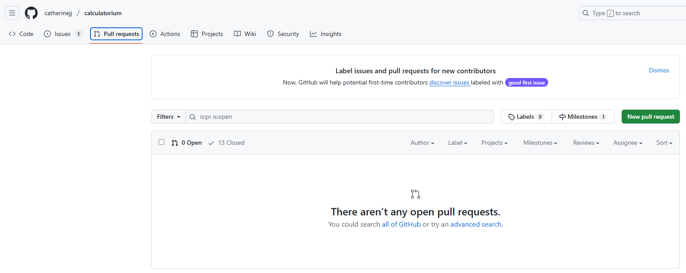
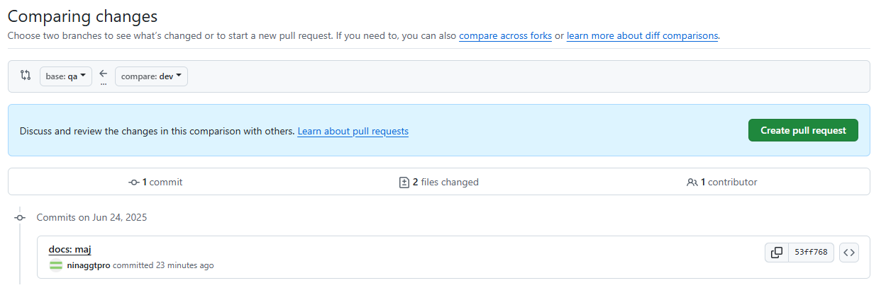
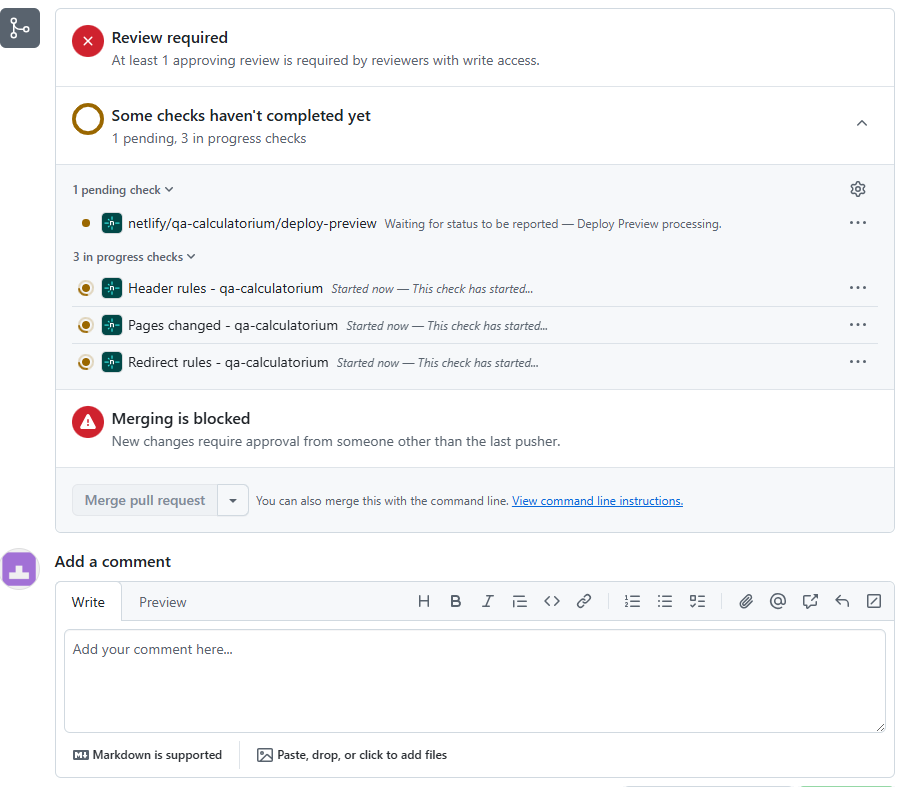
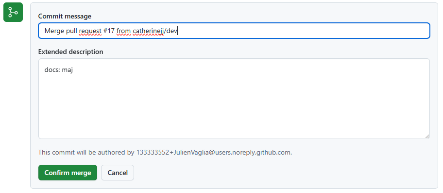

# Comment transferer Dev dans QA 
Dans le but de mettre a disposition les résultat des modification en DEV on va :

1- Appuyer sur pull Request



2- Choisir les branches à réunir


3- Il passe les tests


4- On confirme


5- That's done !


On voit directement les changements dans Netlify.


# Calculatrice Simple Vue.js
Accès https://ephemeral-praline-95cb7d.netlify.app/

## 🚀 Fonctionnalités

- **Opérations de base** : Addition (+), Soustraction (−), Multiplication (×), Division (÷)
- **Interface intuitive** : Design inspiré des calculatrices professionnelles
- **Écran LCD simulé** : Affichage vert phosphorescent avec police monospace
- **Gestion des décimales** : Support complet des nombres à virgule
- **Boutons interactifs** : Effets de survol et d'appui réalistes
- **Responsive design** : S'adapte à tous les écrans
- **Gestion d'erreurs** : Protection contre la division par zéro
- **Fonctions clear** : AC (All Clear) et C (Clear Entry)

## 🛠️ Technologies utilisées

- **Vue.js 3** - Framework JavaScript progressif
- **Vite** - Outil de build rapide
- **CSS3** - Styles modernes avec gradients et animations
- **JavaScript ES6+** - Logique de calcul native

## 📦 Installation

1. Clonez le repository :
```bash
git clone https://github.com/catherinejj/calculatorium.git
cd calculatrice-vue
```

2. Installez les dépendances :
```bash
npm install
```

3. Lancez le serveur de développement :
```bash
npm run dev
```

4. Ouvrez votre navigateur à l'adresse : `http://localhost:5173`

## 🎯 Utilisation

### Opérations de base
- Cliquez sur les chiffres (0-9) pour saisir des nombres
- Utilisez les opérateurs (+, −, ×, ÷) pour effectuer des calculs
- Appuyez sur "=" pour obtenir le résultat
- Utilisez "." pour les nombres décimaux

### Fonctions de contrôle
- **AC** : Efface tout et remet la calculatrice à zéro
- **C** : Efface uniquement la saisie en cours

### Gestion des erreurs
- La division par zéro affiche une alerte et remet la calculatrice à zéro
- Les résultats très longs sont affichés en notation scientifique

## 🎨 Design

La calculatrice présente un design moderne avec :
- **Fond dégradé** : Violet-bleu élégant
- **Boîtier noir** : Style calculatrice professionnelle
- **Écran LCD** : Affichage vert phosphorescent authentique
- **Boutons colorés** :
  - Gris foncé pour les chiffres
  - Orange pour les opérateurs
  - Rouge pour les fonctions clear
- **Effets visuels** : Ombres, transitions et animations fluides

## 📱 Responsive

La calculatrice s'adapte automatiquement aux différentes tailles d'écran :
- **Desktop** : Taille optimale avec tous les effets
- **Mobile** : Interface compacte et boutons adaptés au tactile

## 🔧 Scripts disponibles

```bash
# Développement
npm run dev

# Build de production
npm run build

# Prévisualisation du build
npm run preview
```

## 📁 Structure du projet

```
src/
├── App.vue          # Composant principal de la calculatrice
├── main.js          # Point d'entrée de l'application
└── style.css        # Styles globaux de base
```

## 🤝 Contribution

Les contributions sont les bienvenues ! N'hésitez pas à :
1. Fork le projet
2. Créer une branche pour votre fonctionnalité
3. Commiter vos changements
4. Pousser vers la branche
5. Ouvrir une Pull Request

## 📄 Licence

Ce projet est sous licence MIT. Voir le fichier `LICENSE` pour plus de détails.

## 🎯 Améliorations futures

- [ ] Historique des calculs
- [ ] Fonctions scientifiques (sin, cos, tan, etc.)
- [ ] Thèmes personnalisables
- [ ] Support du clavier
- [ ] Sauvegarde des calculs
- [ ] Mode sombre/clair

---

Développé avec ❤️ en Vue.js
