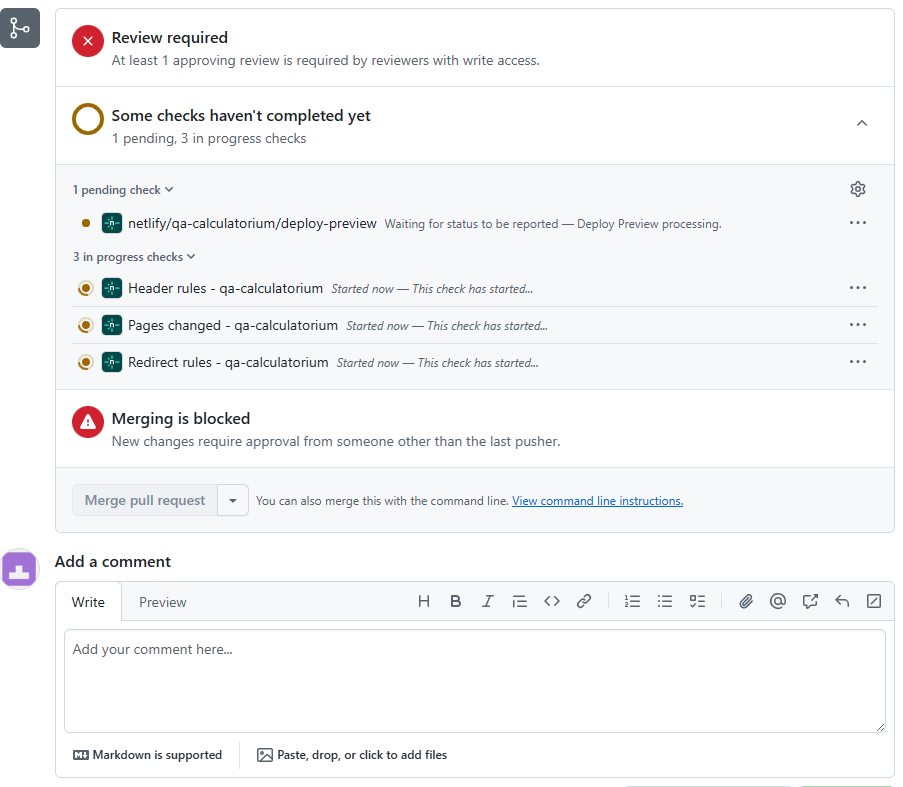

## Comment transférer la branche Dev dans QA (Staging) via GitHub

Cette procédure permet de mettre à disposition en environnement de pré-production (QA / Staging) les dernières modifications développées sur la branche Dev. Ainsi, les tests peuvent être réalisés dans un environnement proche de la production avant la validation finale.

Étapes détaillées

1. Créer une Pull Request (PR) sur GitHub
   Sur GitHub, ouvrez une nouvelle Pull Request depuis la branche dev vers la branche qa (ou staging). Cela prépare la fusion et lance automatiquement les contrôles CI/CD.

Cliquez sur New Pull Request.


Sélectionnez la branche source : dev

Sélectionnez la branche cible : qa

2. Vérifier les branches sélectionnées
   Confirmez que la branche source est bien dev et la branche cible qa. Vérifiez également les modifications listées pour détecter d’éventuels conflits.


3. Contrôler le passage des tests automatisés
   GitHub Actions (ou autre CI configurée) lance automatiquement les tests. Attendez que tous les tests soient validés (status vert).



En cas d’erreur, corrigez localement et poussez une nouvelle version sur dev.

4. Fusionner la Pull Request
   Une fois les tests validés, cliquez sur Merge Pull Request pour fusionner dev dans qa.


Choisissez la méthode de fusion (merge commit, squash, rebase) selon les conventions de votre projet.

5. Vérifier le déploiement sur l’environnement QA
   Après fusion, le système de déploiement automatique se déclenche (par exemple via Netlify ou autre). L’application est mise en ligne sur l’URL de préproduction associée à la branche qa.


`Vérifiez les modifications directement en ligne.`

```Bonnes pratiques
Rédigez un titre clair et une description complète dans la Pull Request.

Utilisez les commentaires pour faciliter la revue par vos collègues.

Ne fusionnez pas si des tests échouent ou s’il y a des conflits.

Surveillez le pipeline CI/CD pour détecter rapidement les erreurs.

Communiquez tout problème rencontré dans l’outil de ticketing.```
```
