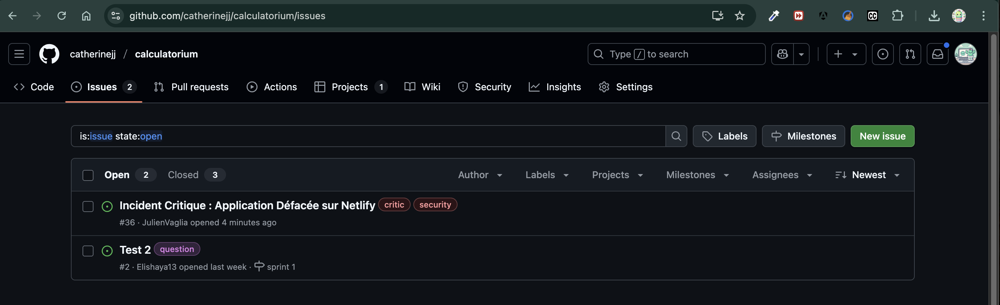
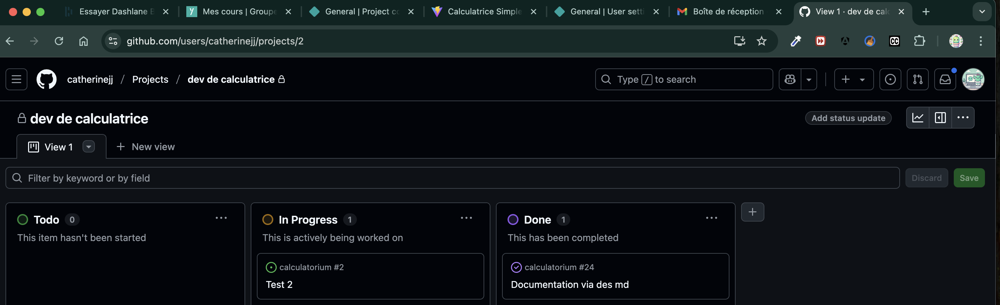

# Liste des participants
- Angie Pons  
- Julien Vaglia  
- Ludovic Andreotti
- Nina Guiguet  
- Catherine Jules  

## Organisation du projet

Nous avons utilisé les issues et le tableau Kanban GitHub pour organiser efficacement le travail de l’équipe.

- Chaque tâche est décrite sous forme d’issue.
- Les issues sont triées dans le tableau Kanban, selon leur état.

### Exemple d’Issue

### Tableau Kanban GitHub

